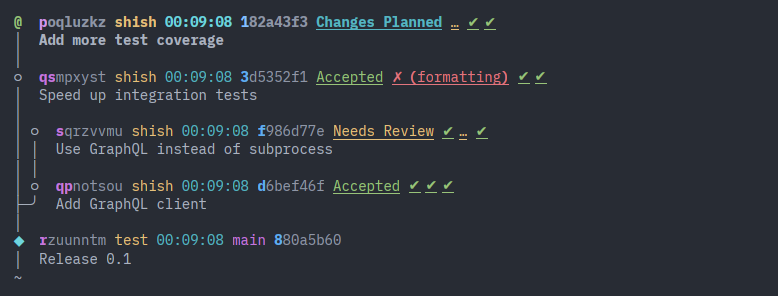
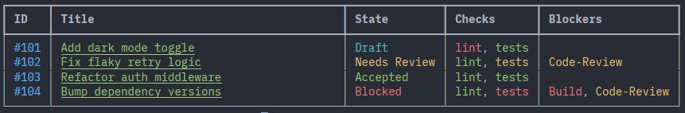

# JJ with Code Review Integration

(For GitHub, Gerrit, Phabricator, and Forgejo; it should be easy to add more)

# Features

* `jj cr upload` - create or update a code review for each commit in the current branch (1 change : 1 review)
* `jj cr rebase` - rebase the current branch on top of its merge target (eg if the PR is based on `main`, rebase on top of `main`; if the PR is based on another PR, rebase on top of that other PR)
* `jj cr list` - list the status of my open PRs/CRs/Diffs
* `jj cr log` - show `jj log` output annotated with review status
* `jj cr download <pr/cr/diff>` - download a specific PR/CR/Diff from the forge

# Stability Notice

Right now my #1 goal is "have something which works for me and my workflows", and I haven't settled on exactly what the interface should look like, so parts may change, internally and externally (eg command names). If other people are interested in this work, let me know and I'll take stability more seriously. If lots of other people are interested, then I'll try to get it polished enough to be considered upstream.

Also for as long as I'm the only person looking at this repo, I'm making liberal use of `jj split` and `jj absorb` to rewrite history so that each layer of the code gets its own commit, as well as rebasing the `jj-cr` branch on top of upstream's `main` branch. Again, if anybody has any interest in collaborating, let me know and I'll switch to a more normal workflow where the foundations aren't constantly-shifting :)

# Why is this useful?

Because I'm regularly using github, gerrit, and phabricator, and I don't like any of their standard `git` workflows (and then I go ahead and use `jj`, which has *much* better client-side UX, but the forge integrations are even less-well-supported...)

I really just want `jj cr rebase` to bring me up to date with remote changes, and `jj cr upload` to submit my local changes for review - automatically Doing The Right Thing (eg updating existing reviews vs creating new ones), working consistently across forges.

# Workflow

* `jj cr rebase --all-branches` - start the day by pulling remote changes and rebasing all my local branches on top of them
* `jj cr list` / `jj cr log` - check for any reviews which need attention

## If I want to work on a new feature

* `jj new 'trunk()'` - create a new branch off of trunk (ie, `main` or `master`)
* `vim ...` - make some changes
* `jj commit` - commit the first unit of work
* `vim ...` - make more changes
* `jj commit` - commit the next unit of work
* `jj cr upload` - upload the two commits for review

## If any of my code needs to be changed based on feedback

* `jj edit <change id>` - switch to the change that needs to be fixed
* `vim ...` - make the changes
* `jj cr upload -m 'fixed the bugs'` - upload an updated version of the commit for review, with a comment listing what changed since last time

## If I want to test somebody else's code

* `jj cr download <pr/cr/diff>` - download a specific PR/CR/Diff from the forge

# Backend Notes

* Backend will be automatically detected based on the git remote URL (eg github.com = use the github backend, codeberg.org = use the forgejo backend)
* If that doesn't work, you can set the backend explicitly with `jj config set --repo cr.forge <backend>`
* You can also skip the forge abstraction layer, replacing eg the lowest-common-denominator `jj cr upload` with the more flexible gerrit-specific `jj gerrit upload`

# Technical Notes

These are a set of patches on top of the upstream Jujutsu repository, because:

* The first proof-of-concept was a python wrapper around jj, and it felt very hacky
* I tried making a stand-alone rust binary which uses `jj_lib` as a dependency, but that seemed very low-level, and I didn't want to re-implement all of the `jj_cli` scaffolding for myself
* I tried using `jj_cli`'s built-in extension points (eg `add_subcommand`) but ran into a few things that I wanted to extend but there's no pre-existing mechanism for it
* I figure if I'm going to be hacking the `jj_cli` crate to add extension points, I might as well have my hacks and the features in the same repo to keep them in sync
* The JJ maintainers appear (as I understand it) to be feeling overall positive towards the broad concept of "forge integrations included in jj".
  * I've rushed ahead and written the code as a proof-of-concept that supports my own workflow, instead of taking the time to write up an RFC and gather feedback and carefully design a solution which supports _everybody's_ workflows, so I don't expect that this code will be merged as-is - but it might be useful as a reference for how jj-native forge-integrations _could_ be implemented.

## Overall design decisions

(Design decisions relevant to specific backends will be comments in the code for that backend)

### Common-ish interface for forge backends

* eg `jj gerrit abandon` and `jj phabricator abandon` and `jj github abandon` - even though github calls it "closing" a PR and not "abandoning", I personally think it's nicer for jj to be internally-consistent rather than consistent with each forge (who all use very different terminology, sometimes mutually-exclusive terminology - eg in phabricator "submit" is synonymous with "upload for review"; in gerrit "submit" is synonymous with "merge into trunk and push")

### Lowest-common denominator front layer

* `jj cr X` should work for every feasible forge, and work as consistently as possible across forges
  * In most cases so far, the generic eg `jj cr abandon <CR ID>` and the backend eg `jj gerrit abandon <CR ID>` take literally the same `CrAbandonArgs` struct
  * It's possible for backends to have backend-specific options, eg my `jj cr upload` has very minimal features, but under the hood it translates into a call to `jj gerrit upload`, and all the power and features of `jj gerrit upload` is still available

### Code review status fetching for `jj cr log`

* resolve the `--revision` flag into a list of Commit IDs which are due to be displayed
* for each Commit ID, try to determine a Code Review ID
  * for gerrit, this is the `Change-Id:` trailer, falling back to the change-id which jj generates during uploads
  * for phabricator, this is the `Diffusion Revision:` "trailer"
  * for github, this is the branch name
* for each Code Review ID, fetch the code review status (ideally in a single batch call if the API supports it)
* create a map of Commit ID -> Code Review Status
* call `jj log` with this status map as an extra parameter
* the custom template function `Commit.review()` will check the status map, and return either `None` or `Some(CodeReview)`
  * CodeReview has various fields for overall status, CI/CD checks, unresolved comments, etc
* the standard templating system renders the CodeReview however the user prefers

-----

# Jujutsu—a version control system

 

**[Homepage] &nbsp;&nbsp;&bull;&nbsp;&nbsp;**
**[Installation] &nbsp;&nbsp;&bull;&nbsp;&nbsp;**
**[Getting Started] &nbsp;&nbsp;&bull;&nbsp;&nbsp;**
**[Development Roadmap] &nbsp;&nbsp;&bull;&nbsp;&nbsp;**
**[Contributing](#contributing)**

[Homepage]: https://www.jj-vcs.dev
[Installation]: https://docs.jj-vcs.dev/latest/install-and-setup
[Getting Started]: https://docs.jj-vcs.dev/latest/tutorial
[Development Roadmap]: https://docs.jj-vcs.dev/latest/roadmap

## Introduction

Jujutsu is a powerful [version control system](https://en.wikipedia.org/wiki/Version_control)
for software projects. You use it to get a copy of your code, track changes
to the code, and finally publish those changes for others to see and use.
It is designed from the ground up to be easy to use—whether you're new or
experienced, working on brand new projects alone, or large scale software
projects with large histories and teams.

Jujutsu is unlike most other systems, because internally it abstracts the user
interface and version control algorithms from the *storage systems* used to
serve your content. This allows it to serve as a VCS with many possible physical
backends, that may have their own data or networking models—like [Mercurial] or
[Breezy], or hybrid systems like Google's cloud-based design, [Piper/CitC].

[Mercurial]: https://www.mercurial-scm.org/
[Breezy]: https://www.breezy-vcs.org/
[Piper/CitC]: https://youtu.be/W71BTkUbdqE?t=645

Today, we use Git repositories as a storage layer to serve and track content,
making it **compatible with many of your favorite Git-based tools, right now!**
However, note that only commits and files are stored in Git; bookmarks
(branches) and other higher-level metadata are stored in custom storage outside
of Git. All core developers use Jujutsu to develop Jujutsu, right here on
GitHub. But it should hopefully work with your favorite Git forges, too.

We combine many distinct design choices and concepts from other version control
systems into a single tool. Some of those sources of inspiration include:

- **Git**: We make an effort to [be fast][perf]—with a snappy UX, efficient
  algorithms, correct data structures, and good-old-fashioned attention to
  detail. The default storage backend uses Git repositories for "physical
  storage", for wide interoperability and ease of onboarding.

- **Mercurial & Sapling**: There are many Mercurial-inspired features, such as
  the [revset] language to select commits. There is [no explicit index][no-index]
  or staging area. Branches are "anonymous" like Mercurial, so you don't need
  to make up a name for each small change. Primitives for rewriting history are
  powerful and simple. Formatting output is done with a robust template language
  that can be configured by the user.

- **Darcs**: Jujutsu keeps track of conflicts as [first-class
  objects][conflicts] in its model; they are first-class in the same way commits
  are, while alternatives like Git simply think of conflicts as textual diffs.
  While not as rigorous as systems like Darcs (which is based on a formalized
  theory of patches, as opposed to snapshots), the effect is that many forms of
  conflict resolution can be performed and propagated automatically.

[perf]: https://github.com/jj-vcs/jj/discussions/49
[revset]: https://docs.jj-vcs.dev/latest/revsets/
[no-index]: https://docs.jj-vcs.dev/latest/git-comparison/#the-index
[conflicts]: https://docs.jj-vcs.dev/latest/conflicts/

And it adds several innovative, useful features of its own:

- **Working-copy-as-a-commit**: Changes to files are [recorded automatically][wcc]
  as normal commits, and amended on every subsequent change. This "snapshot"
  design simplifies the user-facing data model (commits are the only visible
  object), simplifies internal algorithms, and completely subsumes features like
  Git's stashes or the index/staging-area.

- **Operation log & undo**: Jujutsu records every operation that is performed on the
  repository, from commits, to pulls, to pushes. This makes debugging problems like
  "what just happened?" or "how did I end up here?" easier, *especially* when
  you're helping your coworker answer those questions about their repository!
  And because everything is recorded, you can undo that mistake you just made
  with ease. Version control has finally entered [the 1960s][undo-history]!

- **Automatic rebase and conflict resolution**: When you modify a commit, every
  descendent is automatically rebased on top of the freshly-modified one. This
  makes "patch-based" workflows a breeze. If you resolve a conflict in a commit,
  the _resolution_ of that conflict is also propagated through descendants as
  well. In effect, this is a completely transparent version of `git rebase
  --update-refs` combined with `git rerere`, supported by design.

> [!WARNING]
> The following features are available for use, but experimental; they may have
> bugs, backwards incompatible storage changes, and user-interface changes!

- **Safe, concurrent replication**: Have you ever wanted to store your version
  controlled repositories inside a Dropbox folder? Or continuously backup
  repositories to S3? No? Well, now you can!

  The fundamental problem with using filesystems like Dropbox and backup tools
  like `rsync` on your typical Git/Mercurial repositories is that they rely
  on *local filesystem operations* being atomic, serialized, and non-concurrent
  with respect to other reads and writes—which is _not_ true when operating on
  distributed file systems, or when operations like concurrent file copies (for
  backup) happen while lock files are being held.

  Jujutsu is instead designed to be [safe under concurrent scenarios][conc-safety];
  simply using rsync or Dropbox and then using that resulting repository
  should never result in a repository in a *corrupt state*. The worst that
  _should_ happen is that it will expose conflicts between the local and remote
  state, leaving you to resolve them.

[wcc]: https://docs.jj-vcs.dev/latest/working-copy/
[undo-history]: https://en.wikipedia.org/wiki/Undo#History
[conc-safety]: https://docs.jj-vcs.dev/latest/technical/concurrency/

The command-line tool is called `jj` for now because it's easy to type and easy
to replace (rare in English). The project is called "Jujutsu" because it matches
"jj".

Jujutsu is relatively young, with lots of work to still be done. If you have any
questions, or want to talk about future plans, please join us on Discord
,
start a [GitHub Discussion](https://github.com/jj-vcs/jj/discussions), or
send an IRC message to [`#jujutsu` on Libera
Chat](https://web.libera.chat/?channel=#jujutsu). The developers monitor all of
these channels[^bridge].

[^bridge]: To be more precise, the `#jujutsu` Libera IRC channel is bridged to
one of the channels on jj's Discord. Some of the developers stay on Discord and
use the bridge to follow IRC.

### News and Updates 📣

- **December 2024**: The `jj` Repository has moved to the `jj-vcs` GitHub
  organization.
- **November 2024**: Version 0.24 is released which adds `jj file annotate`,
  which is equivalent to `git blame` or `hg annotate`.
- **September 2024**: Martin gave a [presentation about Jujutsu][merge-vid-2024] at
  Git Merge 2024.
- **Feb 2024**: Version 0.14 is released, which deprecates ["jj checkout" and "jj merge"](CHANGELOG.md#0140---2024-02-07),
  as well as `jj init --git`, which is now just called `jj git init`.
- **Oct 2023**: Version 0.10.0 is released! Now includes a bundled merge and
  diff editor for all platforms, "immutable revsets" to avoid accidentally
  `edit`-ing the wrong revisions, and lots of polish.
- **Jan 2023**: Martin gave a presentation about Google's plans for Jujutsu at
  Git Merge 2022!
  See the [slides][merge-slides] or the [recording][merge-talk].

### Related Media

- **Mar 2024**: Chris Krycho started [a YouTube series about Jujutsu][krycho-yt].
- **Feb 2024**: Chris Krycho published an article about Jujutsu called [jj init][krycho]
  and Steve Klabnik followed up with the [Jujutsu Tutorial][klabnik].
- **Jan 2024**: Jujutsu was featured in an LWN.net article called
  [Jujutsu: a new, Git-compatible version control system][lwn].
- **Jan 2023**: Martin's Talk about Jujutsu at Git Merge 2022, [video][merge-talk]
  and the associated [slides][merge-slides].

The wiki also contains a more extensive list of [media references][wiki-media].

[krycho-yt]: https://www.youtube.com/playlist?list=PLelyiwKWHHAq01Pvmpf6x7J0y-yQpmtxp
[krycho]: https://v5.chriskrycho.com/essays/jj-init/
[klabnik]: https://steveklabnik.github.io/jujutsu-tutorial/
[lwn]: https://lwn.net/Articles/958468/
[merge-talk]: https://www.youtube.com/watch?v=bx_LGilOuE4
[merge-slides]: https://docs.google.com/presentation/d/1F8j9_UOOSGUN9MvHxPZX_L4bQ9NMcYOp1isn17kTC_M/view
[merge-vid-2024]: https://www.youtube.com/watch?v=LV0JzI8IcCY
[wiki-media]: https://github.com/jj-vcs/jj/wiki/Media

## Getting started

> [!IMPORTANT]
> Jujutsu is an **experimental version control system**. While Git compatibility
> is stable, and most developers use it daily for all their needs, there may
> still be work-in-progress features, suboptimal UX, and workflow gaps that make
> it unusable for your particular use.

Follow the [installation
instructions](https://docs.jj-vcs.dev/latest/install-and-setup) to
obtain and configure `jj`.

The best way to get started is probably to go through [the
tutorial](https://docs.jj-vcs.dev/latest/tutorial). Also see the [Git
comparison](https://docs.jj-vcs.dev/latest/git-comparison), which
includes a table of `jj` vs. `git` commands.

As you become more familiar with Jujutsu, the following resources may be helpful:

- The [FAQ](https://docs.jj-vcs.dev/latest/FAQ).
- The [Glossary](https://docs.jj-vcs.dev/latest/glossary).
- The `jj help` command (e.g. `jj help rebase`).
- The `jj help -k <keyword>` command (e.g. `jj help -k config`). Use `jj help --help`
  to see what keywords are available.

If you are using a **prerelease** version of `jj`, you would want to consult
[the docs for the prerelease (main branch)
version](https://docs.jj-vcs.dev/prerelease/). You can also get there
from the docs for the latest release by using the website's version switcher. The version switcher is visible in
the header of the website when you scroll to the top of any page.

## Features

### Compatible with Git

Jujutsu is designed so that the underlying data and storage model is abstract.
Today, only the Git backend is production-ready. The Git backend uses the
[gitoxide](https://github.com/Byron/gitoxide) Rust library.

[backends]: https://docs.jj-vcs.dev/latest/glossary#backend

The Git backend is fully featured and maintained, and allows you to use Jujutsu
with any Git remote. The commits you create will look like regular Git commits.
You can fetch branches from a regular Git remote and push branches to the
remote. You can always switch back to Git.

Here is how you can explore a GitHub repository with `jj`.

You can even have a [colocated local
workspace](https://docs.jj-vcs.dev/latest/git-compatibility#colocated-jujutsugit-repos)
where you can use both `jj` and `git` commands interchangeably.

### The working copy is automatically committed

Jujutsu uses a real commit to represent the working copy. Checking out a commit
results in a new working-copy commit on top of the target commit. Almost all
commands automatically amend the working-copy commit.

The working-copy being a commit means that commands never fail because the
working copy is dirty (no "error: Your local changes to the following
files..."), and there is no need for `git stash`. Also, because the working copy
is a commit, commands work the same way on the working-copy commit as on any
other commit, so you can set the commit message before you're done with the
changes.

### The repo is the source of truth

With Jujutsu, the working copy plays a smaller role than with Git. Commands
snapshot the working copy before they start, then they update the repo, and then
the working copy is updated (if the working-copy commit was modified). Almost
all commands (even checkout!) operate on the commits in the repo, leaving the
common functionality of snapshotting and updating of the working copy to
centralized code. For example, `jj restore` (similar to `git restore`) can
restore from any commit and into any commit, and `jj describe` can set the
commit message of any commit (defaults to the working-copy commit).

### Entire repo is under version control

All operations you perform in the repo are recorded, along with a snapshot of
the repo state after the operation. This means that you can easily restore to
an earlier repo state, simply undo your operations one-by-one or even _revert_ a
particular operation which does not have to be the most recent one.

### Conflicts can be recorded in commits

If an operation results in
[conflicts](https://docs.jj-vcs.dev/latest/glossary#conflict),
information about those conflicts will be recorded in the commit(s). The
operation will succeed. You can then resolve the conflicts later. One
consequence of this design is that there's no need to continue interrupted
operations. Instead, you get a single workflow for resolving conflicts,
regardless of which command caused them. This design also lets Jujutsu rebase
merge commits correctly (unlike both Git and Mercurial).

Basic conflict resolution:

Juggling conflicts:

### Automatic rebase

Whenever you modify a commit, any descendants of the old commit will be rebased
onto the new commit. Thanks to the conflict design described above, that can be
done even if there are conflicts. Bookmarks pointing to rebased commits will be
updated. So will the working copy if it points to a rebased commit.

### Comprehensive support for rewriting history

Besides the usual rebase command, there's `jj describe` for editing the
description (commit message) of an arbitrary commit. There's also `jj diffedit`,
which lets you edit the changes in a commit without checking it out. To split
a commit into two, use `jj split`. You can even move part of the changes in a
commit to any other commit using `jj squash -i --from X --into Y`.

## Status

The tool is fairly feature-complete, but some important features like support
for Git submodules are not yet completed. There
are also several performance bugs. It's likely that workflows and setups
different from what the core developers use are not well supported, e.g. there
is no native support for email-based workflows.

Today, all core developers use `jj` to work on `jj`. I (Martin von Zweigbergk)
have almost exclusively used `jj` to develop the project itself since early
January 2021. I haven't had to re-clone from source (I don't think I've even had
to restore from backup).

There *will* be changes to workflows and backward-incompatible changes to the
on-disk formats before version 1.0.0. For any format changes, we'll try to
implement transparent upgrades (as we've done with recent changes), or provide
upgrade commands or scripts if requested.

## Related work

There are several tools trying to solve similar problems as Jujutsu. See
[related work](https://docs.jj-vcs.dev/latest/related-work) for details.

## Contributing

We welcome outside contributions, and there's plenty of things to do, so
don't be shy. Please ask if you want a pointer on something you can help with,
and hopefully we can all figure something out.

We do have [a few policies and
suggestions](https://docs.jj-vcs.dev/prerelease/contributing/)
for contributors. The broad TL;DR:

- Bug reports are very welcome!
- Every commit that lands in the `main` branch is code reviewed.
- Please behave yourself, and obey the Community Guidelines.
- There **is** a mandatory CLA you must agree to. Importantly, it **does not**
  transfer copyright ownership to Google or anyone else; it simply gives us the
  right to safely redistribute and use your changes.

### Mandatory Google Disclaimer

I (Martin von Zweigbergk, <martinvonz@google.com>) started Jujutsu as a hobby
project in late 2019, and it has evolved into my full-time project at Google,
with several other Googlers (now) assisting development in various capacities.
That said, while Google is one of the main contributors, **this is not a
supported Google product**, i.e. support is provided by the community.

## License

Jujutsu is available as Open Source Software, under the Apache 2.0 license. See
[`LICENSE`](./LICENSE) for details about copyright and redistribution.

The `jj` logo was contributed by J. Jennings and is licensed under a Creative
Commons License, see [`docs/images/LICENSE`](docs/images/LICENSE).
